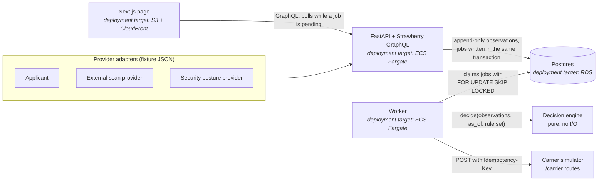

# Risk Evidence Trace

Risk signals about an insurance applicant arrive asynchronously and sometimes disagree; the system produces a deterministic underwriting decision where every point traces back to one piece of evidence and one rule, and every past decision stays reproducible.

```
docker compose up -d --build --wait && make seed
```

Then open http://localhost:3000 and press **Guided demo**.

> The Docker path above is written but has not yet been run end to end on a clean machine. The tested path is the local one in [Running it](#running-it).

Video walkthrough (3 minutes): link added after recording.

## What it does

One page, one interaction: a new piece of evidence visibly changes the decision, and clicking the changed points shows exactly which observation and which rule caused them.

The guided demo walks through five steps against the real backend. The spec had four; the carrier hand-off is split in two so the timeout and the retry can be shown one at a time.

1. **Submission.** Acme Manufacturing (`acme.test`) applies. The applicant attests to MFA and tested backups, and the security posture provider verifies MFA. Decision: QUOTE at -5 points, because verified backups lower the risk.
2. **Late scan.** The external scan provider reports a critical internet-exposed vulnerability on `vpn.acme.test` and no MFA on the VPN login page. A worker recomputes and the decision flips to REFER. The new row is highlighted, and clicking it highlights the observation behind it and shows the rule.
3. **Who do we believe?** Three sources disagree about MFA. Precedence picks the posture provider and marks the other two "superseded by #id". Scenario time then moves forward 6 days: the applicant's backup attestation passes its 90 day window, so it can no longer lower risk and adds a needs-review blocker.
4. **Carrier timeout.** Harbor Dental Group (`harbor.test`) is a clean QUOTE. Sending it to the carrier partner, the first attempt times out, and the worker schedules one automatic retry with the same idempotency key a minute later.
5. **No duplicate.** "Next step" sends the retry now instead of waiting. The carrier had already recorded the first attempt, so it returns its original acknowledgement and the quote exists once. "Send again" afterwards gets the same acknowledgement.

The decision comes from five named rules:

| Rule | Meaning | Effect |
|---|---|---|
| EX-01 | Critical internet-exposed vulnerability | +20 |
| RA-01 | Remote access without MFA | +15 |
| BK-01 | Backups not verified (missing, false or stale) | +10 |
| BK-02 | Recent verified backups | -5 |
| HD-01 | Active ransomware indicator | DECLINE |

0 to 14 points is QUOTE, 15 or more is REFER, HD-01 is always DECLINE, and any needs-review blocker forces at least REFER. A negative total is allowed: it means verified evidence lowered the risk.

## What it deliberately does not do

- No real scanning and no real provider or carrier APIs. Providers are adapters over fixture JSON, and the carrier is a simulator inside the same API.
- No LLM anywhere, and no invented scores or confidence percentages. Points only come from the five named rules.
- No time-travel control in the UI. `as_of` is an argument of the engine and of the `decisionTrace` query, and it is tested there.
- No backoff, jitter, dead letter queue or replay tooling. They are described in [docs/tradeoffs.md](docs/tradeoffs.md).
- No authentication, tenants or user accounts. This is a single-user prototype.
- Time is a per-submission scenario clock, not the wall clock, so the demo stays reproducible.

## Architecture



The AWS names are deployment targets only. Nothing here is deployed.

- `packages/decision` is the pure engine. An architecture test fails if it imports FastAPI, SQLAlchemy or any I/O module.
- `services/api` holds the GraphQL API, ingestion, the worker and the carrier simulator.
- `apps/web` is the one Next.js page.
- `fixtures/` holds the scenario observations.

More detail is in [docs/architecture.md](docs/architecture.md).

## Failure modes and how each is visible

| Failure | What the system does | Where you see it |
|---|---|---|
| Providers disagree | Precedence picks one winner per subject and claim; the losers are kept | "Superseded by #id" on the evidence cards |
| Evidence is too old | It can add risk but never lower it, and it creates a blocker | "Stale after N days" tag, "Needs review" list, REFER |
| A stale source says all clear while a lower source reports risk | The risk still counts, attributed to the lower source | Contribution reason: "Kept because #id is stale" |
| Evidence is missing | BK-01 applies with no observation behind it | A separate "Missing evidence" card, and the row says "Missing evidence" |
| Evidence arrives late or out of order | The decision depends on `observed_at`, never arrival order | Timeline, and the property test over generated orderings |
| The same observation is delivered twice | Nothing new is stored and no job is queued | No new timeline event |
| The worker crashes mid-job | The job lock expires after 60 seconds and another worker reclaims it; recompute is safe to repeat | The job stays pending, then completes |
| Recompute runs with unchanged inputs | No new decision run is stored | Timeline: "Nothing changed" |
| Carrier times out | One automatic retry with the same idempotency key, scheduled a minute later; "Retry now" pulls it forward | Timeline: "Attempt 1 ... failed: timeout. One automatic retry ... is scheduled", then "Retry succeeded" |
| Carrier response is lost after it recorded the quote | The retry gets the stored acknowledgement, no second quote | Timeline: "The carrier had already recorded the first attempt" |
| Carrier is down for both attempts | The transmission is marked failed with the error | Carrier hand-off panel; "Send again" retries with the same key |
| The API is down | The page shows an error banner and keeps the last data | Red banner at the top |

## What changes at 100k submissions a day

100k a day is about 1.2 submissions a second on average. With a few observations each and peaks several times the average, the shape holds, but some parts change:

- **Queue.** The Postgres jobs table with `SKIP LOCKED` copes with this rate, but a managed queue (SQS) takes polling load off the database and comes with a dead letter queue.
- **Recompute coalescing.** Several observations for one submission arriving together should trigger one recompute, not several. The input hash already makes repeats harmless; coalescing makes them cheap.
- **Partitioning.** `observations`, `decision_runs` and `audit_events` are append-only and grow forever. Partition them by month and move cold partitions to cheaper storage while keeping them queryable for reproducibility.
- **Ingestion as its own service.** Provider webhooks need their own intake with backpressure, signature checks and per-provider rate limits, separate from the API that serves underwriters.
- **Rule set rollouts.** A new rule set version means deciding which open submissions to decide again, and keeping both versions for audit.
- **Real time.** The scenario clock becomes the wall clock, and evidence crossing a freshness window needs a scheduled re-check, because no new evidence arrives to trigger one.
- **Observability.** Metrics on queue depth, recompute latency, decision flips and carrier error rates per partner.

## Questions I would ask the team

- Do you treat observations as mutable state or as immutable evidence?
- Where does underwriting policy live today, and who can change it?
- How do you tell real disagreement between providers apart from evidence that is simply stale?
- How is the partner API versioned, and what does a carrier do with a repeated idempotency key?
- Which decisions must be reproducible months later, and for whom?

## Running it

**Tested path (no Docker).** Needs Python 3.12 or newer, Node 22 and a local Postgres listening on `localhost:5433` with a user `rte` and a database `rte`. With Homebrew Postgres, for example:

```
initdb -D .pgdata -U rte --auth=trust --locale=en_US.UTF-8
pg_ctl -D .pgdata -o "-p 5433" -l .pgdata/server.log start
createdb -h localhost -p 5433 -U rte rte
```

Then:

```
make setup
make local-seed
make local-api       # terminal 1: API on :8000 with DEMO_MODE=1 and the carrier timing out once
make local-worker    # terminal 2
make local-web       # terminal 3: page on :3000
```

**Docker path (untested).** `docker compose up -d --build --wait` builds Postgres, the API, the worker and the web page, and `make seed` seeds through the API container. It has not been run end to end yet.

**Checks.** `make check` runs ruff, mypy on the engine, the Python tests (they need the Postgres above and create a separate `rte_test` database), tsc, eslint and a plain-text check. CI runs the same on GitHub Actions. `make check-local` adds a name check that reads a local, uncommitted list, so it only works on the author's machine.

## License

MIT
